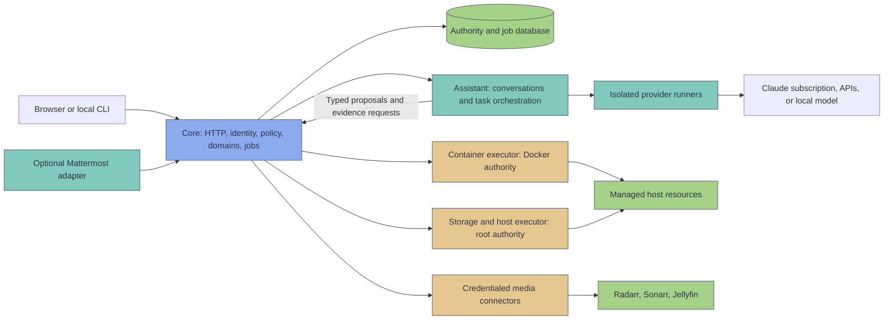

# LimeOS Rust rewrite: target architecture

Status: proposed architecture; P00 spikes are in progress. No production runtime changes made.
Prepared: 2026-10-04; revised the same day after review and the reference-host baseline.
Current build baseline: [Brownster/pi-health@80593b2](https://github.com/Brownster/pi-health/tree/80593b2).

Start with the [delivery roadmap](2026-10-04-rust-rewrite-roadmap.md). The [assistant and model-routing design](2026-10-04-assistant-model-routing.md) specifies subscription support, API adapters, budgets, and model qualification. The [defect register](2026-10-04-rust-rewrite-defect-register.md) lists every known defect in the current build and the rule in this architecture that prevents it.

## 1. Purpose and constraints

Rebuild LimeOS as a small, recoverable Linux host-management application with a first-class assistant. The assistant should explain the system, investigate problems, request movies and television, and carry out explicitly permitted maintenance. Ordinary operation must remain usable when the assistant, its provider, or the internet is unavailable.

The rewrite changes the implementation and trust boundaries. It must preserve existing installations, storage identities, media paths, application configuration, and operator control. Time is available for a correct foundation; that does not justify adding infrastructure without a clear purpose.

Initial targets remain Debian on ARM64 Raspberry Pi 4/5 and x86-64 hosts. Run on the host under systemd. Copy the existing React/TypeScript interface into this repository, move it to the new API screen by screen, and serve it as compiled assets. Rust replaces the backend, privileged execution, scheduling, and assistant orchestration; it does not require rewriting the browser or third-party media applications.

The current build is frozen while the rewrite proceeds; its known defects are prevented here rather than fixed there.

The native assistant is the primary interface. Mattermost is no longer required; whether its transport returns after cutover is decided from actual use. Claude subscription access is a supported first-class provider; native APIs beyond Anthropic and explicitly configured local endpoints follow cutover.

### Outcomes to measure

- Smaller idle memory, CPU use, installation size, and disk writes, measured against the current release on the same hardware.
- Every state-changing request has one permission decision, a durable job, a bounded executor, and a recorded result.
- No application or agent account can edit root-executed release code or directly open the Docker socket.
- A crash or power interruption cannot cause blind replay of a destructive action.
- At cutover, two assistant journeys work end to end: explain an issue with evidence, and perform a permitted repair with verification. Requesting a specific film or series follows in P07.
- A failed provider, exhausted subscription, or exhausted API budget leaves host management available.
- Every row in the defect register has a regression scenario that passes in the new build.

These are acceptance criteria, not claims about an implementation that does not yet exist.

### Why Rust

The two arguments for the language are speed and safety. The [reference Pi 5 baseline](../rewrite-evidence/p00/2026-10-04-reference-pi5-baseline.md) measures the current release; this section states what each argument covers and what it does not.

**Footprint and start-up speed.** The current backend is eight resident Python processes using 251 MiB RSS, with another 100 MiB pushed to swap. Importing the shared libraries costs each process about 34 MiB and 0.5–0.7 s before it does any work. That per-process cost is what makes the isolation in section 4 expensive in Python: every authority boundary is another interpreter. The [RW-005 footprint spike](../rewrite-evidence/p00/2026-10-04-rw005-footprint-result.md) measured the planned minimal stack at 4.55 MiB idle PSS, no swap, and 15.8–23.5 ms readiness on the reference Pi 5, including one Docker read and fresh database initialization. This establishes the stack's starting cost; the combined core/executor and configured-service budgets still require measurement as the real services arrive. Short-lived executor tasks and `limeosctl` retain the under-20-ms target in section 10.

Request latency is not where most of the speed gain comes from. Loopback requests to the current server take 1.5–1.8 ms before handler work, and the slow parts of real requests are external commands: `docker compose ls` takes 98 ms and `docker ps` 22 ms. The largest past speed-up, Docker stats from 35 s to 0.07 s, was an algorithm change. Expect request gains mainly under concurrency, because the current server is Werkzeug's development server, and in CPU-bound parsing. Measure authenticated endpoint latency in P00 before claiming a user-visible request speed-up.

Idle CPU is already low: all LimeOS units averaged 0.41% of one core over 70 days. Disk writes are dominated by design, not language: the supervised repair runner writes 189 MB a day to a 135 KB SQLite file. Section 10's write rules fix that in the rewrite; the frozen Python service retains this accepted defect until cutover.

**Safety.** Python is already memory-safe, so memory safety is not a gain over the current implementation. It matters for new native code: protocol framing, archive inspection, and root-side validation can be written without C. The safety gains over Python are:

- Compile-time checking of the job state machine, operation registry, executor protocol, and error types. Exhaustive matching turns whole classes of runtime errors in root-executed paths into compile errors; Python type hints are not enforced.
- Compiler-enforced freedom from data races in shared state across Tokio tasks. Logical races, such as two operations on one resource, still need the per-resource locks in section 7.
- Root executes a compiled, root-owned binary with no interpreter, import path, virtualenv, or bytecode cache to replace. On the reference host the root helper runs a file owned and writable by the dashboard's account. Root-owned releases (A07) fix that, not the language, but a single binary makes it the default instead of an installer discipline.
- No package installation on the host at runtime. Dependencies are pinned at build time and checked with `cargo audit` and `cargo deny`.

Rust does not fix logic errors, argument injection, path traversal, wrong-disk selection, check-then-act races, or crate supply-chain risk. The operation registry, executor ceilings, and descriptor-based path handling address those, and they would be needed in any language.

**What stays the same size.** With the assistant enabled, optional runtimes dominate total memory: Mattermost and its PostgreSQL use about 235 MiB RSS on the reference host, and the Claude CLI is a 270 MB executable started per assistant turn. Rewriting LimeOS does not shrink them; making Mattermost optional does.

## 2. What to preserve and what to change

The current project already contains useful service boundaries, dependency-injected ports, strict storage contracts, cached container observations, persistent metric history, and an agent action ledger. Preserve their intent and tests where they describe desired behavior. Reassess incidental behavior rather than translate each Python file into a Rust file.

| Observed implementation | Consequence | Target decision |
|---|---|---|
| [Flask application](https://github.com/Brownster/pi-health/blob/80593b2/app.py) and [large privileged helper](https://github.com/Brownster/pi-health/blob/80593b2/pihealth_helper.py) span many domains. | It is difficult to identify the authority and failure behavior for an operation. | Separate pure domain logic, orchestration, transport, and privileged execution. |
| [Installer](https://github.com/Brownster/pi-health/blob/80593b2/setup.sh) gives the application Docker access and links privileged helper code into the checkout. | A writable application checkout and Docker access widen the host compromise boundary. | Root-owned releases; only a dedicated executor can use Docker. |
| [Operation manager](https://github.com/Brownster/pi-health/blob/80593b2/operation_manager.py) uses process-local threads and retained events. | Ordinary UI operations do not have the same recovery guarantees as the agent ledger. | One durable job system for browser, CLI, scheduler, and assistant. |
| [Agent integration](https://github.com/Brownster/pi-health/blob/80593b2/agent_integration_service.py) requires Mattermost; [runtime](https://github.com/Brownster/pi-health/blob/80593b2/agent_runtime/service.py) instantiates the Claude CLI and Mattermost listener. | Conversation setup is coupled to a chat server and a particular provider. | Native conversations; independent provider and transport adapters. |
| [Provider contract](https://github.com/Brownster/pi-health/blob/80593b2/agent_gateway/provider.py) has text messages and a single tool request per reply. | Native provider tool calls, continuation state, and usage do not fit cleanly. | A richer canonical task contract with provider-specific protocol adapters. |
| [Plugin manager](https://github.com/Brownster/pi-health/blob/80593b2/plugin_manager.py) imports third-party code into the application. | An extension inherits application access and credentials. | Declarative capabilities and approved isolated extensions. |
| Backup restore in [the helper](https://github.com/Brownster/pi-health/blob/80593b2/pihealth_helper.py) extracts an archive over the host root. | Restore has broad authority and needs stronger archive and destination checks. | Staged, validated restore of a closed set of managed paths. |
| [Capability permissions](https://github.com/Brownster/pi-health/blob/80593b2/capability_security.py), [agent actions](https://github.com/Brownster/pi-health/tree/80593b2/agent_actions), and older routes enforce permissions in different places. | Caller-specific checks can drift. | One operation registry and one policy engine. |

The reference host adds two observations. Its root helper runs a file that the dashboard account owns and can write, and the dashboard account is in the `docker` group, so compromising the dashboard is enough to gain root either way.

This is an architectural inspection, not a comprehensive vulnerability assessment. The [defect register](2026-10-04-rust-rewrite-defect-register.md) collects the confirmed defects from earlier reviews and the baseline. Early implementation work must confirm the deployed configuration and threat model.

## 3. Decision record

| ID | Decision | Reason and consequence |
|---|---|---|
| A01 | A modular Rust application with process boundaries for different authority. | Domain code stays easy to test; privileged and model-facing processes are isolated. No service mesh or distributed database. |
| A02 | Axum, Tokio, Tower, Serde, and explicit dependency-injected traits. | Async transport with bounded concurrency; pure domain code does not depend on HTTP or subprocesses. |
| A03 | SQLite for local authority and durable jobs; separate telemetry and conversation databases. | No database server required by the base product. Distinct retention and durability policies. |
| A04 | All mutations use versioned, typed operations and durable plans. | The browser and assistant cannot acquire different routes to the same effect. |
| A05 | Assistant orchestration is unprivileged; provider runners and credentialed connectors are separate. | Model output remains untrusted input. Compromise of a runner does not grant host administration. |
| A06 | Copy the React UI and move it to the new API screen by screen; generate transport contracts from Rust. | Keeps the component library and layout while concentrating rewrite risk on the backend. The UI owes no compatibility to the Flask API. Revisit frontend performance after measurement. |
| A07 | Root-owned releases as Debian packages from a signed apt repository, managed by a narrow updater. | No production `git pull`, `pip install`, or source editing by the application. apt already verifies signed metadata, installs root-owned files, and runs maintainer scripts; the targets are Debian only. |
| A08 | One cutover per installation after parity, with read-only shadow running beforehand. | The current build is frozen, so switching domains one at a time would need changes to it. The two builds never mutate the same host at once, and the return path is to re-enable the untouched current build. |
| A09 | Claude subscription and several API families are supported independently of the permission system. | Users can select price, capability, privacy, and availability without changing access rights. |
| A10 | Extensions declare resources and operations; execution requires explicit isolation and approval. | A downloaded manifest is data, never permission to run arbitrary host code. |

Do not add Redis, PostgreSQL, Kubernetes, an event broker, a vector database, a Rust browser rewrite, or dynamically loaded native plugins to the base architecture. Add infrastructure only when a measured requirement outweighs its operational cost. PostgreSQL inside an existing Mattermost installation remains that application's dependency.

## 4. Processes and trust boundaries



The diagram describes authority, not a separate always-running daemon for every box. The base installation has the core and the two narrow executors. Assistant, provider, connector, and transport runtimes start only when configured; share a runtime only when the credential and trust boundary is the same. Storage/package/update tasks may use short-lived executor services rather than resident workers.

| Process | Allowed access | Forbidden access |
|---|---|---|
| `limeos-core` | HTTP sessions, policy, core DB, approved configuration, bounded local RPC; authoritative observations through executors. | Root privileges, Docker socket, provider login homes, arbitrary host command execution. |
| `limeos-assistant` | Its conversation DB; scoped core RPC; provider task interface. | Core DB files, host secrets, Docker/root sockets, arbitrary host filesystem access. |
| Provider runner | Only its provider credential/login home, a bounded task input, and its configured outbound endpoint. | Core/executor sockets, other providers' credentials, application checkout, media files. |
| Media connector | Only its connector credential and registered service endpoint; typed requests from core. | General outbound URL fetching, root/Docker access, arbitrary filesystem writes. |
| `limeos-containerd` | Docker API and approved stack release locations, fixed Compose commands. | Caller-supplied shell or executable paths; unconstrained commands. |
| `limeos-storaged` and host task services | Specifically registered disks, mount units, shares, protection jobs, and package/update actions. | General-purpose root command API or arbitrary restore destination. |

Docker socket access is effectively host-root authority, even for an otherwise unprivileged executor account. Isolating it reduces exposure; it does not make Docker administrative access harmless. [Docker's Linux post-install documentation](https://docs.docker.com/engine/install/linux-postinstall/)

Unix sockets use distinct directories, owner/group permissions, kernel peer credentials, versioned framing, and request deadlines. A peer UID alone is insufficient for user authorization: core resolves a real session or a scoped task token. The assistant cannot submit an arbitrary `username` and receive that user's rights.

Task tokens are random opaque values stored in `core.sqlite`, bound to the intended service, task, operations/resources, grant revision, expiry, and core generation. Core both issues and checks them, so a database lookup gives expiry and revocation without signing keys. Every token is invalid after a core restart, and durable jobs are recovered explicitly.

Executors authenticate core by kernel peer credentials on a socket only core's account can open, then check each request against their own root-owned ceilings and current resource state. They do not verify a signature from core: core would hold the signing key, so a signature would prove only what peer credentials already prove. The root safety policy below states what this does and does not protect against.

The network-facing HTTP transport remains a module in core initially. A separate HTTP process could reduce parser exposure, but would add identity delegation and another protocol without removing the risk of stolen sessions. The important initial boundaries are between core, models, credentials, and host authority.

### Root safety policy

Executors independently enforce a root-owned operation allowlist, managed resource scope, boot-device exclusion, executable locations, and operation-specific constraints. Core supplies an immutable authorized plan containing operation/version, action and step IDs, principal reference, grant revision, resource identity, normalized plan digest, expiry, and expected state.

An executor checks the request and current resource preconditions before execution. A core authorization is never authority to substitute another disk, executable, mountpoint, or Compose file. Root policy is a ceiling; a user grant can narrow it but cannot broaden it.

The executor protocol has no free-form file-content, shell, or path-to-execute field. Executors render every unit file, configuration file, and script from templates they own, using typed parameters they validate themselves.

Core is still a trusted security component. A compromised core could misuse operations allowed by that ceiling and fabricate its own internal approvals. This architecture limits damage through independent executor constraints; it does not claim protection from every core or kernel compromise. Particularly dangerous resources can require a local administrator to enable them in root-owned policy.

## 5. Workspace and dependency direction

```text
Cargo.toml                         # workspace; pinned lockfile and toolchain
crates/
  domain/                         # resources, storage identities, plans, invariants
  contracts/                      # RPC/HTTP/event types and generated schemas
  policy/                         # roles, scopes, approval rules, grant revisions
  jobs/                           # state machine, resource locks, recovery, scheduling
  persistence/                    # core repository traits and SQLite implementation
  observations/                   # bounded probes, snapshots, freshness, telemetry
  containers/                     # container and stack orchestration
  storage/                        # disks, pools, protection, mounts, shares
  media/                          # profiles, stable identities, request lifecycle
  integrations/                   # declarative capabilities and connector registry
  assistant/                      # conversations, evidence, task budgets, routing
  provider-contracts/             # canonical model requests/events/capabilities
  provider-adapters/              # separate modules/features for each native family
  api/                            # Axum handlers, sessions, static UI, SSE
  executor-protocol/              # closed operation and receipt schemas
  executor-container/             # Docker and approved Compose effects
  executor-host/                  # root operations with independent validation
  release/                        # apt-based update, activation health checks, recovery
bins/
  core/                           # composition root; wiring and service lifecycle
  assistant/                      # isolated task/conversation runtime
  provider-runner/                 # launched under per-connection identity
  connector-runner/                # launched under credential-scoped identity
  containerd/
  storaged/
  ctl/                            # diagnose, inspect, request, recover
frontend/                         # React UI copied from the current build, moved to /api/v1 per phase
catalog/                          # versioned, declarative built-in capabilities
packaging/                        # Debian packages, maintainer scripts, systemd units, apt repository
tests/
  contracts/ fixtures/ scenarios/ privileged-vm/ migration/ provider-conformance/
docs/adr/                         # accepted decisions and superseding decisions
```

These are ownership boundaries, not a requirement to create every crate before the first feature. Start with domain, contracts, policy, jobs, persistence, API, executors, and binaries; split domain crates when a vertical slice needs them. A small crate should justify its independent boundary.

Dependency rule: transport and adapters depend on domain contracts; domain does not import HTTP, Docker, SQLite, or a model SDK. Only binary composition roots select concrete implementations. Operation definitions are shared, but root validation remains independent of application policy.

Use `reqwest` with Rustls for native HTTP adapters; `rusqlite` on a dedicated bounded database worker for SQLite; `tracing` for structured events; and generated OpenAPI/JSON Schema plus TypeScript contracts, provisionally using `utoipa`. Pin exact compatible versions and the Rust edition/MSRV in P01 after ARM64 and Debian builds. [Axum documentation](https://docs.rs/axum/latest/axum/), [rusqlite documentation](https://docs.rs/rusqlite/latest/rusqlite/), [utoipa documentation](https://docs.rs/utoipa/latest/utoipa/)

Forbid unsafe Rust in ordinary project crates. Review any narrowly isolated syscall code and native dependencies. SQLite and existing host utilities remain native code; a Rust rewrite improves memory-safety opportunities without eliminating logic bugs, injection, or supply-chain risk.

## 6. Data ownership and durability

| Store | Owner and contents | Durability and retention |
|---|---|---|
| `core.sqlite` | Core only: users, sessions, grants, resource registry, plans, approvals, jobs, executor receipts, connector references, audit events, budget reservations. | WAL with `synchronous=FULL`; durable intent before effects; bounded readers and explicit checkpoints. |
| `metrics.sqlite` | Observation writer: sampled metrics and aggregate history. | Batched writes, `NORMAL` acceptable for disposable samples; preserve 31-day history through aggregation and size bounds. |
| `conversations.sqlite` | Assistant only: scoped messages, source references, task checkpoints, encrypted provider continuation blobs. | Configurable retention and deletion; restart-safe task checkpoints; no direct access to core tables. |

Use local storage on the OS/configuration disk. SQLite WAL requires participating processes on the same host and is unsuitable for a network filesystem. Do not put these databases on remote mounts or a pooled media path. Bundle a vetted SQLite version at least 3.51.3, or a verified backport, because upstream documents a WAL-reset corruption fix there. [SQLite WAL documentation](https://www.sqlite.org/wal.html)

Key entities and constraints:

| Entity | Required fields and constraints |
|---|---|
| Principal / grant | Stable principal ID; role plus operation/resource scopes; revision increments on permission changes. |
| Resource | Opaque resource ID; provider/type; managed status; identity and state revision; connector reference, never secret values. |
| Plan | Versioned operation; normalized validated parameters; resource identities; risk/approval policy; digest; precondition snapshot. |
| Approval | Plan digest; approving principal; nonce; expiry; grant revision; single-use claim; immutable audit event. |
| Job / step | Principal and idempotency key; unique request constraint; lifecycle state; the core generation that dispatched it; deadline; intent, receipts, verification. |
| Event | Increasing cursor; job/principal/resource scope; safe structured payload; retained bytes and export policy. |
| Assistant task | Core-issued task ID and authority scope; conversation reference; permitted tool set; step and spending limits. |
| Budget reservation | Task/request/connection ID; price revision; worst-case reserved amount; usage state; unique settlement record. |

Index jobs by state/next-run time and resource, events by scope/cursor, grants by principal/resource, and reservations by budget period. Enable foreign keys, validate schema versions, and use transactional migrations. Plans and approvals are immutable; a changed plan requires a new approval.

There is no atomic transaction spanning the three databases or spanning SQLite and the host. Core owns task authority and money reservations; assistant data is a projection linked by stable IDs. Recover missing projections from core facts without repeating a model request or host effect automatically.

Configuration files follow three rules. Reads distinguish missing, corrupt, and valid; a corrupt file is quarantined beside the original and reported, never replaced with defaults. Reads never write. Writes use a temporary file, `fsync`, and an atomic rename.

### Runtime layout and releases

```text
/usr/lib/limeos/                        # root-owned binaries, UI, schemas, catalog (Debian package)
/var/cache/limeos/packages/             # previous packages kept for offline downgrade
/etc/limeos/system-policy/              # root-owned executor ceilings and endpoints
/etc/limeos/                            # migrated operator configuration, scoped ownership
/var/lib/limeos/core/                   # core-owned authority DB and managed state
/var/lib/limeos/assistant/              # assistant-owned conversation state
/var/lib/limeos/providers/<connection>/ # isolated provider credential/login home
/var/lib/limeos/executors/              # protected receipts and task state
/run/limeos/                            # per-service sockets and systemd credentials
/var/log/limeos/                        # bounded logs where journald is insufficient
```

Release activation and executor binaries are root-owned, and no root unit references a path an unprivileged account can write. Services run as dedicated system users, never root (except the host executor) and never a human login account. Runtime state, secrets, and source code have different owners and paths. Provider keys use per-service credential delivery, such as systemd credentials, or an equivalently protected store; a shared credentials file readable by every service is unacceptable. Backups encrypt secrets with a key kept outside the archive and document recovery of that key.

Preserve existing `/mnt/...`, stack directories, media numeric UID/GID, and container paths such as `/data/media`, `/data/downloads`, and `/config`. Import the [storage contract](https://github.com/Brownster/pi-health/blob/80593b2/storage_contract.py), including `single_disk`, `separate_downloads`, and `protected_pool`; do not silently change mounts or move data during code migration.

## 7. Operations, jobs, and recovery

An operation definition specifies its parameter schema, capability scope, resource resolver, risk class, planning function, fresh preconditions, approved executor, verification, timeout, output bounds, and recovery classification. Examples: `container.restart@1`, `media.movie.add@1`, `storage.mount@1`. Risk comes from this registry, never from a model's description.

Request flow:

1. Authenticate the real caller; resolve resource scope and current grant revision.
2. Validate typed input; observe required state; produce a normalized plan with an impact summary.
3. Obtain any required approval bound to that plan. Read-only requests and an already authorized media request need no redundant confirmation.
4. Commit the job, its first intent, and the consumed approval atomically.
5. Dispatch a fixed operation envelope. Executor checks policy, identity, expiry, and preconditions again.
6. Record its receipt, independently verify the resulting state, and publish scoped events.

Job states: `planned`, `waiting_approval`, `queued`, `running`, `verifying`, `succeeded`, `failed`, `canceled`, `precondition_changed`, `outcome_unknown`, and `needs_intervention`. Authorization is a recorded transition into `queued`, not a free-floating reusable approval. A per-resource lock prevents a second conflicting step.

Core runs as a single systemd instance, so jobs need no leases. On start, core increments its generation and, before dispatching anything new, asks each executor about every job left `running` or `verifying`. An executor holds an exclusive resource lock for the lifetime of the actual effect, independent of core, so a core restart cannot start a second effect while the first is still running. Reconcile host state before resuming or failing an interrupted job.

Default concurrency: four core job workers, one mutating job per resource, one destructive storage job per host, and one assistant turn at a time. Read concurrency and queue lengths are separately bounded. Long-running protection jobs hold resource locks and publish progress; they cannot block HTTP request workers.

Executors persist a receipt keyed by action/step ID. Receipt deduplication does not create exactly-once effects: power can fail after a host effect and before recording its result. Each operation declares how to reconcile actual state. Retry only when its idempotency is established; an ambiguous format, restore, or data deletion stops for intervention. Compensating steps are explicit operations with their own checks, not a promise of universal rollback.

Recheck permission and kill-switch state before each new step. Revocation stops subsequent steps; an in-flight effect may need a safe completion or operation-specific cancellation. Closing a browser or disconnecting a chat is not job cancellation.

Subprocesses use fixed executables and argv, a small explicit environment, output byte limits, deadlines, and process-group termination. Do not collect unlimited output and truncate only after completion. No executor operation accepts a shell string.

## 8. HTTP, local RPC, and authentication

Use `/api/v1` for new transport contracts, versioned local RPC, and stable machine-readable errors. Local JSON framing starts with a 64 KiB cap; larger document uploads use a separately bounded endpoint, never a global unlimited frame setting. Set request-body, header, stream-buffer, and total deadline limits.

| Endpoint | Purpose |
|---|---|
| `GET /api/v1/resources` | Scoped resource inventory and observation freshness. |
| `POST /api/v1/plans` | Validate and preview a typed operation and its impact. |
| `POST /api/v1/plans/{id}/approvals` | Fresh authorized approval of that exact plan. |
| `POST /api/v1/jobs` | Queue an authorized plan with an idempotency key. |
| `GET /api/v1/jobs/{id}` | Durable progress, verification, and recovery status. |
| `POST /api/v1/jobs/{id}/cancel` | Request operation-specific cancellation. |
| `GET /api/v1/events` | Scoped SSE replay using a durable event cursor. |
| `POST /api/v1/conversations` | Create a principal-scoped conversation. |
| `POST /api/v1/conversations/{id}/messages` | Start a bounded assistant turn. |
| `GET /api/v1/provider-connections` | Credential-free health, availability, and usage summaries. |

Create additional domain read endpoints through the same policy path. GET never starts an operation: every mutation is a POST with CSRF validation that creates a plan or job, and progress streams from a read-only job resource. A job submission returns `202` with a job reference; a precondition conflict is explicit, not a generic success. Error envelopes contain a stable code, safe explanation, retry classification, and audit ID. SSE retention gaps return a snapshot/reload instruction rather than pretend missing events were delivered.

Core owns password verification and sessions. Use a vetted Argon2id implementation for new passwords with parameters measured on the Pi, compatible verifiers for the Werkzeug scrypt and PBKDF2-SHA256 hashes the current build accepts, tested against hashes it generated, and upgrade hashes after a successful login. Secure, HttpOnly, SameSite cookies, CSRF validation for browser mutations, explicit CORS, rate limits, and session revocation are required. Session references passed to local transports are authenticated, not self-asserted actor names.

Default roles: viewer, media requester, operator, administrator. The current build has no roles, so imported users become administrators. Roles expand into operation/resource scopes; they are not checks embedded in route handlers. Household users may add media while being unable to deploy containers, read service keys, or modify disks. Return the same permission decisions through every transport.

Serve HTTPS with a documented local trust or reverse-proxy path. Initial enrollment uses a one-time local bootstrap flow; do not publish a reusable default password or send permanent credentials over an unprotected network session. Keep local recovery available if browser authentication or TLS configuration fails.

## 9. Secure execution and extensions

Threats in scope: untrusted LAN requests, stolen user sessions, prompt injection through logs/catalogs/chat, malicious archives and manifests, compromised provider processes, extension supply chains, accidental storage selection, stale observations, and interrupted operations. Kernel compromise and unrestricted physical root access remain outside the application's isolation guarantees.

Use distinct systemd identities, a restrictive umask, read-only release files, bounded memory/tasks/CPU, and deny unnecessary address families and devices. Apply `NoNewPrivileges`, filesystem protections, capability limits, and syscall restrictions where compatible with each service. Executors require individual policies, not the same blanket sandbox as the web application.

Mount behavior needs a dedicated integration test. Filesystem sandbox directives can create mount namespaces and prevent changes from propagating to the host. Prefer persistent host mounts managed through validated systemd mount/automount units; do not assume a namespace setting makes helper mount calls visible globally. [systemd execution documentation](https://github.com/systemd/systemd/blob/main/man/systemd.exec.xml)

Disk mutations resolve live UUID/serial identity and exclude the boot/root disk immediately before action. Paths use descriptor-based traversal with beneath/no-symlink constraints where supported, plus explicit mount identity checks. A string prefix check is insufficient against traversal, symlinks, and swapped mounts. [Linux `openat2` documentation](https://man7.org/linux/man-pages/man2/openat2.2.html)

Boot-time mount waits test the storage contract's device mount points with a bounded timeout, so a wrong list fails a unit instead of hanging boot. Unmounts and runtime mount loss stop dependent stacks first. Protection jobs verify that every configured path is a mounted source with the expected identity, refuse pool paths, and fail closed when a safety check cannot run. Every host operation reports its real exit status and verified state, never an assumed success.

Backup restore first inspects an archive in a staging directory: allowed destinations, path normalization, links, permissions, ownership, entry count, expanded bytes, and checksum. Use database-aware snapshots, not an arbitrary live DB file copy. Show the restore plan, stop affected services, keep a recovery snapshot, apply only managed paths, and verify. Never extract an untrusted archive over `/`.

Compose/catalog operations validate schemas, pin artifacts where practical, and display an impact diff. A template requiring privileged containers, host mounts, devices, or the Docker socket needs a specific elevated deployment grant. The model cannot convert a media-request permission into a catalog-deployment permission. LimeOS writes managed override files and never re-serializes operator-authored Compose files. A per-stack lock covers file edits and conflicting Docker operations, and a stack directory is deleted only after a successful shutdown.

Built-in integrations compile into approved adapters. Third-party capability manifests can describe UI, observations, setup, and typed operations. Executable extensions use a versioned out-of-process protocol with explicit filesystem/network/credential access and resource bounds. Defer WASM until a concrete extension needs it; WASM alone does not authorize safe host actions.

## 10. Observations, performance, and footprint

Maintain one observation subsystem rather than duplicate dashboard probes. Use Docker events plus periodic reconciliation, shared system snapshots, adaptive polling, and freshness metadata; never one Compose process per stack per poll. Each optional source, such as a secondary disk or a sensor, fails independently and is reported as missing; one unavailable source never fails a whole response. Existing caches are a useful starting point. Disk identity and dangerous-operation preconditions must use fresh evidence, even when the dashboard is cached.

Pause expensive dashboard-only sampling without subscribers. Batch telemetry writes, retain aggregates, bound logs and SSE history by bytes as well as age, and place backpressure on mutation queues. Periodic schedulers commit state transitions only; an unchanged poll writes nothing. If core cannot persist intent, refuse a mutation; losing a telemetry sample is acceptable. If audit space approaches its cap, alert and export/rotate under policy rather than erase unresolved operation history.

The [reference Pi 5 baseline](../rewrite-evidence/p00/2026-10-04-reference-pi5-baseline.md) is recorded; a Pi 4 with an SD-card OS disk and an x86-64 host remain to be measured. Provisional P01 performance targets, to confirm or revise with recorded reasoning:

| Measurement | Baseline, reference Pi 5 | Initial target and accounting |
|---|---|---|
| Core and base executors, idle memory | Dashboard and root helper: 67 MiB PSS plus 32 MiB swap. | At most 30 MiB PSS combined, with no steady-state swap. Measure PSS and swap, not RSS alone. |
| All resident LimeOS processes, idle memory | Eight processes: 251 MiB RSS, 193 MiB PSS, 100 MiB swap. | At most 60 MiB PSS, including the assistant when configured. Report the Claude CLI, local models, and Mattermost/PostgreSQL separately. |
| Backend CPU | 0.41% of one core averaged over 70 days, including use. | Under 0.1% of one core over a 10-minute idle window; report the long-run average alongside. |
| Process start-up | Python with application libraries: 0.54–0.73 s, 41 MiB. Metrics collector: 218 ms wall, 111 ms CPU every 5 minutes. | Executor tasks and `limeosctl` under 20 ms; core ready under 1 second. External service availability reported separately. |
| Cached observation HTTP p95 | Unauthenticated loopback floor 1.5–1.8 ms; authenticated reads not yet measured. | Under 20 ms on the reference Pi, excluding network transit; finalize from the authenticated baseline. |
| Disk writes | Supervised repair runner 189 MB/day; dashboard 0.2 MB/day. Helper child jobs (backup, protection) not yet attributed. | Resident LimeOS processes under 20 MB/day; backup and protection jobs reported separately. |
| Installation footprint | Checkout 21 MB plus four virtualenvs (133 MB), plus system Python. | Below the 154 MB baseline including UI assets, excluding the Claude CLI. Use one multi-call binary if separate binaries mostly duplicate each other. |
| Reproducible workload | Reference Pi 5: 18 containers, NVMe OS disk, USB data disks. | Reference Pi 4/5 with 20 containers, 8 registered disks, and 3 open dashboards. Record exact hardware and sample intervals. |

Measure assistant, Claude CLI, provider children, Mattermost/PostgreSQL, and any local model separately and also report total configured-system memory. CLI and local-model costs cannot be hidden inside an attractive Rust-backend figure. Streaming improves perceived latency; actual completion latency and queue wait remain measured.

## 11. Updates, maintenance, and degraded operation

Ship Debian packages from a signed apt repository. apt verifies the repository signature, package hashes, and `Valid-Until` freshness before installing. The narrow updater adds a pinned repository key, an allowed version range, and a refusal to install below the minimum safe version. Do not invent a separate hash-only update scheme. [Debian SecureApt](https://wiki.debian.org/SecureApt)

Maintainer scripts are idempotent, safe to rerun, and validate preserved configuration instead of trusting it; on invalid configuration they stop with a named repair step and leave the file untouched. Host prerequisites such as the memory cgroup and journal cap have one detection rule and one repair, owned by the host executor and called by the maintainer scripts. Boot-file writes are atomic.

Health checks determine whether an upgrade succeeds. Database migrations declare reversibility and compatible application versions. Automatic downgrade to the previous package is allowed only when the state schema remains compatible; otherwise use the recorded backup/recovery procedure. Keep previous packages locally so a downgrade works offline. Maintain a minimum safe release version with an explicit authorized recovery exception where necessary.

The Debian package is the only supported distribution. Do not publish a container image of LimeOS itself; it cannot provide the executor boundary.

The assistant can maintain the application through approved status, restart, diagnostics, catalog, and signed-update operations. Code changes follow a separate development path: sandboxed checkout, branch, tests, reviewable diff, and ordinary signed release. It must not patch live application source or edit executor policy to make its own action succeed.

Provide `limeosctl` and an offline recovery runbook for service health, bounded diagnostics, update status, restoring a compatible state snapshot, and disabling automation. Basic recovery cannot require a functioning model or web UI. Deterministic alerts and notification delivery also operate without an LLM.

## 12. Migration rules

Build and test beside the current build without changing it. Before cutover, the new build runs on the reference host read-only: its own port and login, executor ceilings limited to read operations, and no access to the current build's files or databases. Compare semantic results with fixtures and live shadow reads. Mutations are tested only on a separate test host.

Cut over once per installation. The migration tool imports configuration into versioned destinations, reports unsupported settings, preserves a snapshot, and verifies ownership. It leaves the current build's source and original database/configuration contents untouched. Before changing ownership, modes, ACLs, or account groups on shared managed resources, it records their previous values. The return path stops the new build's units, restores access required by the current build, and re-enables its services; tests verify configuration and Docker access with the original service account. The new build takes port 8002 at cutover.

Never let both builds mutate the same host or share writable SQLite databases. Each of these needs a recorded migration decision:

- Accounts and Werkzeug scrypt/PBKDF2-SHA256 hashes; imported users become administrators.
- The service account. The current build runs as the installing user's login account, which is in the `docker` group and owns stacks, configuration, and credentials; some installations run it as root. Move ownership to the new service users, and ask before removing a login account from `docker`.
- State sources: `/etc/limeos`, `/var/lib/limeos` (five SQLite databases and about 20 JSON files), and configuration edited inside the deployed checkout.
- Storage contracts, stack paths, package state, approvals, schedules, and notification mappings.

Existing Mattermost remains installed until its owner chooses otherwise. If P00 keeps the Mattermost transport, import verified actor mappings and reconnect credentials rather than infer users from display names. Existing media and storage content stays in place. A Rust cutover is not permission to format drives, recreate pools, redeploy every stack, or discard conversation history.

Every feature is mapped in the roadmap before retiring Python. Archived behavior that is intentionally removed must have an explicit documented rationale and migration path, not disappear because its module was overlooked.
